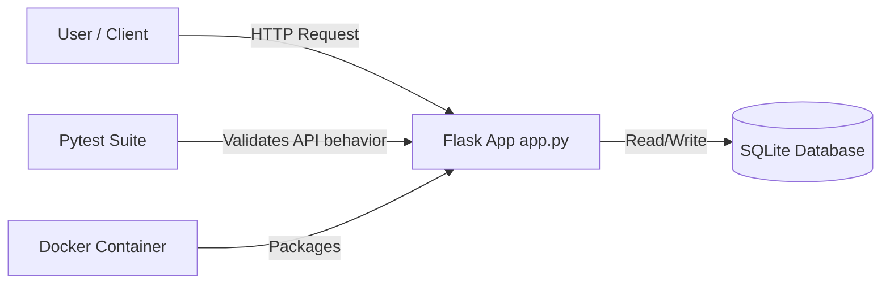
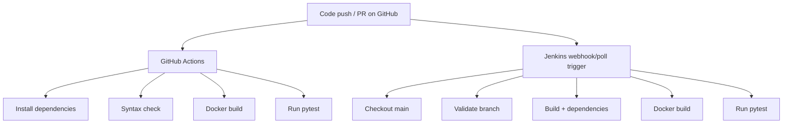

# ACEest Fitness & Gym - DevOps Assignment

This project is my Assignment 1 submission for the DevOps unit.  
I built a small Flask app for fitness client/workout tracking, then wired it with Docker, GitHub Actions, and Jenkins so every code change can be validated automatically.

## What's in this repo

- `app.py` - Flask API with endpoints for clients and workouts
- `tests/test_app.py` - unit tests written with `pytest`
- `requirements.txt` - Python dependencies
- `Dockerfile` - container build for the app
- `.github/workflows/main.yml` - CI checks on push/PR
- `Jenkinsfile` - Jenkins pipeline for build + test automation

## System architecture diagram



## Local setup and execution instructions

```bash
python3 -m venv .venv
source .venv/bin/activate
pip install -r requirements.txt
python app.py
```

Quick check:

```bash
curl http://127.0.0.1:5000/health
```

Expected output:

```json
{"status":"ok"}
```

## Steps to run tests manually

```bash
pytest -q
```

## Docker

```bash
docker build -t aceest-fitness:latest .
docker run --rm -p 5000:5000 aceest-fitness:latest
```

## High-level Jenkins and GitHub Actions integration logic

## CI/CD pipeline diagram



### GitHub Actions

On every `push` and `pull_request`, the workflow:

1. installs dependencies,
2. checks Python syntax,
3. builds the Docker image,
4. runs the pytest suite.

### Jenkins

The Jenkins pipeline is configured to monitor the `main` branch and run automatically when changes are pushed/merged.  
Stages are:

- Checkout
- Validate Branch
- Build
- Docker Build
- Test

### How both pipelines work together

- GitHub Actions acts as the first CI gate on each branch update and pull request.
- Jenkins independently watches `main` and runs a full build/test flow when changes are merged or pushed.
- Both pipelines run syntax checks, Docker build, and tests, giving two validation points before and after integration.
